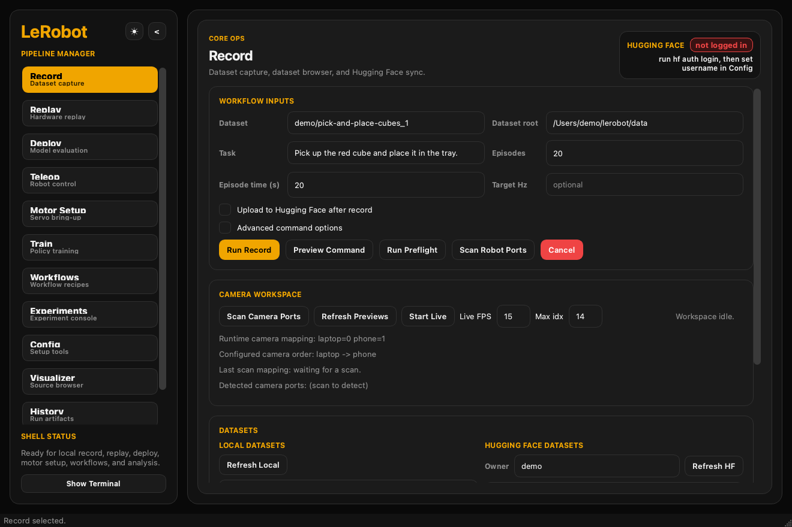
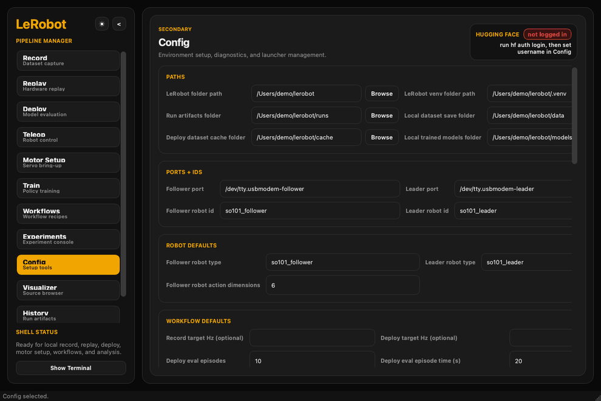

# LeRobot Pipeline Manager

A local desktop control center for LeRobot hardware bring-up, teleoperation, recording, training, deployment, and experiment review.

[](https://github.com/matthewwoodc0/lerobot-gui-wrapper)
[](https://www.python.org/)
[](LICENSE)



The app keeps LeRobot as the execution layer. It adds saved rig profiles, preflight checks, recoverable workflow queues, run history, artifact lineage, support bundles, and one interface for the full local workflow.



The demo uses a safe example configuration. It does not start a robot command.

## Why I built this

LeRobot has a strong command-line workflow, but repeated lab work also needs configuration recall, clear preflight failures, run recovery, and a record of what produced each artifact. I built LeRobot Pipeline Manager to make those operator tasks visible and repeatable without hiding the commands that run underneath.

## Where it fits now

[LeLab](https://huggingface.co/docs/lerobot/lelab) is Hugging Face's first-party GUI and is the best default for SO-ARM101 onboarding. LeRobot Pipeline Manager remains useful as a local-first research and operations companion when you need queue recovery, replay, experiment comparison, support bundles, or detailed run lineage.

This `0.1.0` release is a portfolio-ready alpha, not a replacement for LeLab. It is validated against LeRobot `0.5.x` and supports `0.4.x` through entrypoint and flag fallbacks. LeRobot `0.6.x` is not yet validated. A later phase will update the compatibility layer.

## Built with Codex

I used Codex as an engineering collaborator for architecture reviews, implementation, refactoring, test coverage, and documentation. I set the product direction, reviewed the changes, and validated the workflows. Codex is a development tool for this repository; it is not a runtime dependency.

## Table of Contents

1. [Quick Start](#quick-start)
2. [Installation and dependency policy](#installation-and-dependency-policy)
3. [Prerequisites](#prerequisites)
4. [Installation](#installation)
5. [Platform Setup](#platform-setup)
6. [Your First Session](#your-first-session)
7. [Tabs at a Glance](#tabs-at-a-glance)
8. [Resources and Guides](#resources-and-guides)
9. [Getting Help](#getting-help)
10. [License](#license)

---

## Quick Start

Already have LeRobot 0.5.x installed? Three commands and you're running:

```bash
conda activate lerobot
git clone https://github.com/matthewwoodc0/lerobot-gui-wrapper.git && cd lerobot-gui-wrapper
pip install -e ".[gui]"
python3 robot_pipeline.py gui
```

New to this? Follow the full [Installation](#installation) section below.

## Installation and dependency policy

The base package has no required dependencies by design. It can be imported by LeRobot environments that already manage their own Qt and OpenCV builds. For normal desktop use, install the `gui` extra:

```bash
pip install -e ".[gui]"
```

The extras are also available separately:

- `.[qt]` installs PySide6 for the desktop interface.
- `.[media]` installs headless OpenCV for camera previews and video playback.
- `.[dev]` installs the test, lint, type-check, and documentation dependencies.

Use `opencv-python-headless`, not `opencv-python`, when possible. This reduces Qt plugin conflicts in mixed LeRobot environments.

---

## Prerequisites

Before installing the GUI wrapper, confirm you have:

| Requirement | Notes |
|---|---|
| LeRobot `0.4.x` or `0.5.x` | See installation steps below if not yet set up |
| Python 3.12 conda environment | The wrapper requires 3.12+; LeRobot runs from its own venv |
| SO-101 arms or compatible hardware | With calibration files created |
| `ffmpeg` | Required for dataset recording — `conda install ffmpeg` |
| Serial port access | On Linux: `dialout` group membership required |

---

## Installation

### Step 1 — Install LeRobot 0.5.0

If you already have a `lerobot` conda environment, remove it first:

```bash
conda deactivate
conda remove -n lerobot --all -y
```

Create a fresh environment:

```bash
conda create -n lerobot python=3.12 -y
conda activate lerobot
```

Install LeRobot with feetech (SO-101) support:

```bash
cd ~/lerobot
pip install -e ".[feetech]"
```

> If you are not using SO-101/feetech motors: `pip install -e "."` instead.

Verify the install:

```bash
pip show lerobot | grep Version
```

Install ffmpeg:

```bash
conda install ffmpeg -y
```

---

### Step 2 — Install the GUI Wrapper

```bash
git clone https://github.com/matthewwoodc0/lerobot-gui-wrapper.git
cd lerobot-gui-wrapper
pip install -e ".[gui]"
```

> The `gui` extra installs PySide6 and `opencv-python-headless`. The base package stays dependency-free so advanced users can supply compatible Qt and OpenCV builds from an existing LeRobot environment.

---

## Platform Setup

### macOS

No extra steps needed. Robot devices appear as `/dev/tty.*` or `/dev/cu.*`. Launch with:

```bash
conda activate lerobot
python3 robot_pipeline.py gui
```

---

### Linux

**Serial port permissions** — add your user to `dialout` and log out/back in:

```bash
sudo usermod -aG dialout $USER
# then log out and back in
```

**If the GUI fails to start with an `xcb-cursor` error:**

```bash
conda install -c conda-forge xcb-util-cursor -y
export LD_LIBRARY_PATH="$CONDA_PREFIX/lib:$LD_LIBRARY_PATH"
```

Make that export permanent so you never see it again:

```bash
echo 'export LD_LIBRARY_PATH="$CONDA_PREFIX/lib:$LD_LIBRARY_PATH"' >> ~/.bashrc
source ~/.bashrc
```

Launch:

```bash
python3 robot_pipeline.py gui
```

If xcb errors persist, try the Wayland backend:

```bash
QT_QPA_PLATFORM=wayland python3 robot_pipeline.py gui
```

**Stable device paths on Linux** — Use `/dev/serial/by-id/...` paths instead of `/dev/ttyACM0` etc. These stay constant across reboots even when USB port order changes:

```bash
ls /dev/serial/by-id/
```

---

### Linux — Shared or Lab Machine

Everything above applies, plus:

- The wrapper sanitizes Qt plugin paths at startup to avoid conflicts with other users' OpenCV environments — no `sudo` fix required just to launch.
- Add `LD_LIBRARY_PATH` to `~/.bashrc` (not system-wide).
- Prefer `opencv-python-headless` to avoid plugin conflicts with other users' envs.

---

## Your First Session

A complete zero-to-working walkthrough for a new machine or a new robot pair. Budget about 10–15 minutes.

### 1. Launch and open Config

```bash
conda activate lerobot
python3 robot_pipeline.py gui
```

Open the **Config** tab.

### 2. Set your paths

Fill in at minimum:

| Field | What to set |
|---|---|
| `lerobot_dir` | Path to your LeRobot checkout, e.g. `~/lerobot` |
| `lerobot_venv_dir` | Auto-fills after you set `lerobot_dir` — or set manually |
| `follower_port` | Serial device for the follower arm |
| `leader_port` | Serial device for the leader arm |
| `follower_robot_id` | e.g. `red4` |
| `leader_robot_id` | e.g. `white` |
| `camera_laptop_index` | USB camera index, typically `0` or `2` |
| `camera_phone_index` | Second camera index if present |
| `record_data_dir` | Where recorded datasets are saved locally |
| `trained_models_dir` | Where trained model folders live |
| `name_iteration_policy` | How Record, Training, Deploy, Workflows, Experiments checkpoint deploy, and History reruns handle name collisions: `manual`, `auto`, or `always` |

Click **Apply Path Defaults** to auto-fill derivative paths from `lerobot_dir`, then click **Save Config**.

`name_iteration_policy` defaults to `auto`:
- `manual` keeps typed names unchanged and surfaces collisions for you to fix manually
- `auto` advances only auto-managed names
- `always` advances colliding names even after you type them explicitly

### 3. Run diagnostics

Click **Run Setup Check**. Fix any `FAIL` items before continuing.

Click **Run Doctor**. This checks hardware, environment, and calibration. Resolve all `FAIL` items.

> **Common first-run failures:** missing `feetech-servo-sdk` (install it via pip), serial port permissions (see Linux section above), ffmpeg not found (install via conda).

### 4. Verify hardware with Teleop first

Open the **Teleop** tab. This is the fastest way to confirm the entire hardware chain is working — ports, IDs, and calibration — before you commit to a full record session.

1. Click **Scan Robot Ports**.
2. Confirm or assign follower/leader ports.
3. Set robot IDs if they don't match.
4. Click **Preview Command** to review the generated command.
5. Click **Run Teleop**.
6. In the Teleop Helper window, watch for the arms to respond. Move the leader arm — the follower should mirror it within a second.

If teleop starts but arms don't respond, a calibration prompt may be waiting in the log. See [Calibration Failures](Resources/first-time-setup.md#if-teleop-fails-on-calibration).

### 5. Verify cameras

Switch to the **Record** tab. Click **Scan Camera Ports**. Assign the correct roles (laptop/phone) to the detected indices. Click **Refresh Camera Preview** and confirm the views look right.

### 6. Record a short test dataset

Still in **Record**:

1. Leave the dataset name on its auto-managed value (e.g. `your_name_1`).
2. Set episodes to `2`, episode time to `10`, and a simple task description.
3. Click **Run Record** and complete two short episodes.

If this completes cleanly, your full stack is working.

### 7. You're ready

The machine is ready for normal use once:

- `Run Setup Check` shows no unresolved `FAIL`
- `Run Doctor` shows no unresolved `FAIL`
- Teleop starts and arms respond
- Camera preview is correct
- One short record run completes

---

## Tabs at a Glance

| Tab | Purpose | When to use |
|---|---|---|
| **Config** | Paths, hardware defaults, named rigs, diagnostics | First-time setup; any time environment or hardware changes |
| **Teleop** | Live teleoperation with the leader arm | Hardware bring-up verification; free-form exploration |
| **Record** | Teleoperated dataset collection + HF upload | Building training datasets |
| **Deploy** | Evaluate a trained model on hardware | Testing a policy after training |
| **Training** | HIL adaptation from a base model + dataset | Fine-tuning with human intervention |
| **Experiments** | Cross-run comparison of train/deploy/sim-eval | Picking the best checkpoint; tracking progress over runs |
| **History** | Full run log with outcome annotation | Reviewing what worked; annotating episode successes |
| **Replay** | Replay recorded episodes on hardware with local/HF dataset picking | Verifying data quality |
| **Motor Setup** | First-time servo bring-up | New robot or new port assignment |
| **Workflows** | Sequential multi-step recipes | Record → Upload, Train → Deploy in one queue |
| **Visualizer** | Browse datasets, videos, and model metadata | Inspecting recorded data; navigating model folders |

Name iteration is controlled globally from **Config**. The same `manual` / `auto` / `always` policy is applied across Record, Training, Deploy, queue launches, checkpoint deploys from Experiments, and deploy reruns from History.

---

## Resources and Guides

Full documentation lives in the [`Resources/`](Resources/) folder. Start here based on what you need:

### Getting started
- [First-Time Setup Walkthrough](Resources/first-time-setup.md) — new machine, new robot pair, or after USB changes
- [Compatibility Matrix](Resources/compatibility-matrix.md) — which LeRobot versions work with which wrapper features

### Core workflow guides
- [Teleop Guide](Resources/teleop-tab-guide.md) — command options, preflight, Teleop Helper
- [Record Guide](Resources/record-tab-guide.md) — dataset naming, camera setup, HF upload, troubleshooting
- [Deploy Guide](Resources/deploy-tab-guide.md) — model selection, eval naming, preflight, results
- [Training Guide](Resources/training-tab-guide.md) — HIL adaptation, srun wrapping, checkpoint discovery
- [Experiments Guide](Resources/experiments-tab-guide.md) — cross-run comparison, WandB integration
- [History Guide](Resources/history-tab-guide.md) — outcome annotation, replay launch, lineage

### Hardware and configuration
- [Hardware Operations Guide](Resources/hardware-operations-guide.md) — Replay, Motor Setup, named rigs, local workflows
- [Config Tab Guide](Resources/config-tab-guide.md) — all config fields, named rigs, community profiles, launcher

### Reference
- [Error Catalog](Resources/error-catalog.md) — preflight error codes and fixes
- [Community Profiles](Resources/community-profiles.md) — portable config sharing
- [Support Bundle Guide](Resources/support-bundle.md) — creating debug exports for bug reports
- [Upstream Bridge Guide](Resources/upstream-bridge.md) — how the wrapper integrates with LeRobot

---

## Getting Help

**Something failing in preflight?** Check the [Error Catalog](Resources/error-catalog.md) — it maps every diagnostic code to an actionable fix.

**Unexpected behavior after an update?** Check the [Compatibility Matrix](Resources/compatibility-matrix.md) for known version-specific quirks.

**Need to file a bug?** Use **Export Support Bundle** in the Config tab to generate a redacted diagnostics archive, then open an issue at [github.com/matthewwoodc0/lerobot-gui-wrapper/issues](https://github.com/matthewwoodc0/lerobot-gui-wrapper/issues) and attach the bundle.

**Building on or contributing to this project?** See the [Developer Guide](docs/DEVELOPER.md).

## License

Licensed under the [Apache License 2.0](LICENSE).
